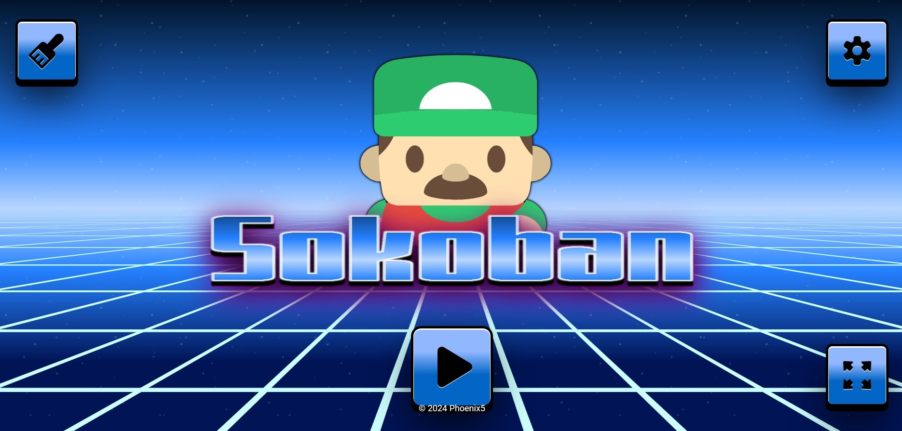

# Sokoban Game

Sokoban is a classic puzzle game where the player pushes boxes around a maze, trying to put them in designated storage locations. This project is an implementation of Sokoban using React and TypeScript.



## Features

-   Classic Sokoban gameplay with intuitive controls.
-   Multiple levels of increasing difficulty to challenge players.
-   Undo functionality to revert moves and try again.
-   Responsive design for playability across different devices, including mobile phones.
-   Ability to generate new maps and provide solutions for them.
-   Power-up features to enhance gameplay.
-   Sound and color match the stage for an immersive experience.
-   Highscore and history tracking to keep track of player progress.

## Getting Started

Follow these instructions to get a copy of the project up and running on your local machine for development and testing purposes.

### Prerequisites

-   Node.js installed on your machine
-   npm package manager
-   Vite installed globally

### Installation

1. Clone the repository:

```bash
git clone https://github.com/Cloticc/lexicon-react-game.git
```

2. Navigate to the project directory:

```bash
cd .\lexicon-react-game\game\
```

3. Install dependencies:
```bash
npm install
```
3. Install dependencies:
```bash
npm install
```
### Building for Production

To build the project for production, run:
```bash
npm run build
```
This will create an optimized build of the game in the dist directory.

## Collaboration
This is a team project, all parts of the project are developed collaboratively.
<strong>Phoneix</strong> was the name of the group
<strong>Lexicon React course 2024 (Sweden)</strong>, where we got the task
to make the Sokoban game in React.

## Team Members
1. Fredrik Berglund
2. Andreas Isidorsson
3. Abbas Mansoori
4. Alireza KafshdarToosi
5. Konstantios (Had to leave early)


## Future improvement
1. 
2. 
3. 

## Contributing


## License
